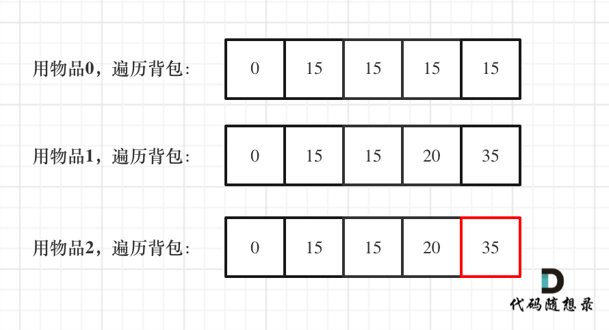

# 背包问题


> 01 背包

## 01 背包纯题（这系列是重中之重）

`有n件物品和一个最多能背重量为w 的背包。第i件物品的重量是weight[i]，得到的价值是value[i] 。每件物品只能用一次，求解将哪些物品装入背包里物品价值总和最大。`

 **题目分析**

1. 这个题看了 网站 没看明白，去看视频也在关键的 递推公式 那里看了好几遍才理解到底什么意思
2. 但是知道是什么意思后就变得非常有趣了，脑子又开阔了一点

> DP 五部曲（我们慢慢学习与分析）

1. 确定dp数组以及下标含义

   1. dp[i]\[j] 表示 第 i 个物品 在容量为 j 的背包中能存储物品的最大价值。
   2. 也就是说 dp[i]\[j] 表示的是具体的价值。
   3. 为什么 j 不是固定的呢？
      1. 因为 背包容量 j，不是题目问多少就固定多少
      2. 而是题目问 求 j 的容量时，我们还需要考虑这个物品装不装进背包，如果装的情况就要减掉当前的容量，用剩下的容量再去装其他物品的最大值
   4. 后续能发现，这个和思维顺序有关，是正向还是逆向思维比较重要（先装一个物品，剩下的容量求最大值；流出一个物品的容量，剩下容量求最大值）

2. 确定递推公式

   1. 在01背包中，dp[i]\[j] 可以由两种方式得出
      1. 第 i 个物品不装进背包时，产生的最大价值（可以理解为背包容量不够装入新的物品了）
      2. 第 i 个物品需要装进背包时，产生的最大价值（可以理解为背包容量足够装入新物品）
         1. 这种情况下进行思考，如果背包容量本身是充足的，但是装了其他物品了，这个物品就装不进背包了吗
         2. 👆不是的，如果背包本身容量足够，在这种选择下一定是先装这个物品，再从剩下的空间去装最有价值的物品
      3. 通过比较以上两种情况下，背包中产生的最大价值，记录下来给 dp[i]\[j]，存储起来给后续使用
   2. 理论叙述完毕，接下来是公式
      1. `dp[i][j] = Math.max(dp[i-1][j],dp[i-1][j-weight[i]]+value[i])`
      2. `dp[i-1][j]`: 表示在 j 的容量下，不装 i 时，背包产生的最大价值
      3. `dp[i-1][j-weight[i]]+value[i]`：表示预留了 装下 i 需要的容量后，能放进背包的物品的最大价值 + 物品 i 的价值。总和就是这一种情况 的 背包内物品最大价值

3. 初始化

   1. 从 dp[i]\[j] 出发，进行初始化，画个图会很好理解，这是由一个二维数组构成
   2. i 为 0 时，dp[0]\[j] 是如何赋值的
      1. i 为 0，表示放入下标为 0 的物品，那此时的 背包容量 只要能放得下 weight[0] 的，都把 value[0] 的价值赋值给 dp[0]\[j] ，如果放不下就用 0 初始化
   3. j 为0 时，dp[i]\[0] 是如何赋值的
      1. j 为 0 ，表示背包容量为 0，那无论放哪个物品，都初始化为 0 
      2. 也就是说 dp[i]\[0] 全部都为 0

4. 遍历顺序

   1. 从 递推公式  ：`dp[i][j] = Math.max(dp[i-1][j],dp[i-1][j-weight[i]]+value[i])`
      1. 可以看出 dp[i]\[j] 依赖于 前面的项，无论装不装 物品 i ，都需要借助前一项或者 前几项求值	
      2. 至少需要求出 前 i 个物品在背包容量为 j 或 0 到 j-weight[i] 之间
      3. 从二维数组中可以看出，求 dp[i]\[j] ，就是依赖于它所在位置的左上方那一片区域中的一个值
      4. 只要保证能在求 dp[i]\[j] 之前把它左上角的值都求出来就可以了

5. 举例推导

   1. 给出三个物品：[1,2,3]

   2. 重量分别为：[1,3,4]

   3. 价值分别为：[15,20,30]

   4. 背包容量为： 4

   5. 最终求出 背包容量为 4 时 最大价值是多少

   6. `dp[i][j] = Math.max(dp[i-1][j],dp[i-1][j-weight[i]]+value[i])`

   7. ```javascript
      物品/容量：   0 ，1， 2  ，3，  4
      		1.  15，15，15，15,15
      		2.  0，15，15，20，35
      		3.  0，15，15，20，35
      ```

```javascript
function testWeightBagProblem (weight, value, size) {
    // 定义 dp 数组 这个二维数组的初始化一开始又看懵了，想了想才反应过来并不是多维数组，因为只嵌套了两层，并且 是用先 遍历 物品 再遍历容量 的方式构建 二维数组，全部都初始化赋值为 0
    const len = weight.length,
          dp = Array(len).fill().map(() => Array(size + 1).fill(0));

    // 初始化 这里进行了剪枝，从容量为 第一个物品的重量位置开始遍历。这样前面容量小于第一个物品重量的那些情况默认为 0 就好了
    for(let j = weight[0]; j <= size; j++) {
        dp[0][j] = value[0];
    }

    // weight 数组的长度len 就是物品个数
    for(let i = 1; i < len; i++) { // 遍历物品
        for(let j = 0; j <= size; j++) { // 遍历背包容量
            // 这个 if 的判断很牛很细节，只有当 当前背包总容量 小于 物品重量时才 是不装这个物品的情况；否则就得装与不装两者一起比较取最大的
            if(j < weight[i]) dp[i][j] = dp[i - 1][j];
            else dp[i][j] = Math.max(dp[i - 1][j], dp[i - 1][j - weight[i]] + value[i]);
        }
    }
	// 最终打印一下 dp 数组验证一下答案
    console.table(dp)

    return dp[len - 1][size];
}

function test () {
    console.log(testWeightBagProblem([1, 3, 4, 5], [15, 20, 30, 55], 6));
}

test();
```

> 总结

1. 这个 01 背包的难点不知是在 递推公式，虽然我花了很多时间才理解了 递推公式的含义。但这类题目的难点实际上是 初始化 以及 如何进行遍历。也就是 DP 五部曲 的详细代码实现部分
2. 目前自己还没有试过自己写出一道 DP 题，也就是使用 五部曲 自己写一道题目，这样即使笔试时遇到也还是不太会，找个机会自己练练吧
3. 这个题目在LeetCode没有，卡玛网我也没有登录，就先花了很多时间看懂 了 网站、视频、自己总结、别人题解
4. 最后这个题解的格式可以学起来
   1. 写出核心函数
   2. 尾部使用一个 test 函数测试打印 自己给的用例，这样可以很好的验证 举例推导 部分，查 bug 很方便


## 01背包 问题纯题（滚动数组）

`有n件物品和一个最多能背重量为w 的背包。第i件物品的重量是weight[i]，得到的价值是value[i] 。每件物品只能用一次，求解将哪些物品装入背包里物品价值总和最大。`

 **题目分析**

1. 卡哥的想法是 既然 每次 dp[i]\[j] 都依赖于上一行的左上角部分，而不是依赖于左边或者下边1，那不如就把左上角那一行覆盖到当前行，把 二维数组 变成 一维数组
2. 也就是 滚动数组 的由来，用 一行数组 表示不同的 容量j 下所包含的最大价值，一直遍历 j 直到到达 目标值求得价值
3. 那这个题目就变成了：从 容量为 0 的背包开始遍历，一直到 背包容量为 j 时，背包中所能容纳最大价值的物品是多少。

> DP 五部曲

1. dp[j] 的含义：
   1. 表示 第 j 个背包容量所能容纳的最大物品价值
2. 递推公式：
   1. `dp[j] = Math.max(dp[j],dp[j-weight[i]+value[i]])`
   2. `dp[j]` ：因为 当前行 都是旧的数据，那 dp[j] 就表示不装物品 i 时的最大容量
   3. `dp[j-weight[i]+value[i]]`：当前容量 减去 装下 i 时的容量，在此容量下的最大 价值 + 物品 i 的最大价值，然后求和。表示装下 物品 i 后的最大价值
   4. 由此递推公式可以发现，实际上这个一维数组就表示：
      1. 先装第一个物品时，求出不同的容量最大的价值记录下来。
      2. 接着装第二个物品，再求出不同的容量的最大价值，如果装超过不装的就更新数据，如果装不下或者装了价值反而小了，就不变，保证每一个容量下存放的都是最大价值
      3. 接着以此类推，直到装到 第 i 个物品，此时经过迭代，求得 第 j 个容量 的价值后即可收手
      4. 这样的好处是之前遍历过的 第一个物品、第二个... 不需要的数据都被覆盖，只保证最后组数据用得上，原理还是 物品 在递增
   5. 拓展思维，能不能交换物品和背包容量的循环呢？
      1. 那就是说求出容量 1 时，不同物品装进去的最大价值，容量不足的或者容量够但装了这个装不了那个时，就保持不变，容量够并且装下 i 以及 之前的某些物品时，价值最大
      2. 不太好用这种方法，因为假设背包容量为 5，第三个物品重量是 4，那 dp[3] 表示 不同容量在可以装下 物品 3 时（可以选择不装）的最大价值，那么就涉及到 容量相减，最终还是回到 另一个容量下的最大价值。但是这种遍历方式，依赖于前面的容量时的最大价值。
      3. 理论上好像是ok的：dp[i] 表示不同容量 在可以装下第 i 个物品时的最大价值，每次容量需要比较 装 物品 i 以及不装 物品 i 时谁的价值最大，进行缓存起来，存的地方是 一个数组，它表示：不同的 物品数量 在随着容量增加后，它所能带来的最大价值
      4. 最终在最后一个容量时，进行遍历每一个物品，比较不装物品时的最大价值，和 装了 物品的最大价值
      5. 物品也是从后面往前面遍历
      6. **思考** ：我是想像打球练弱侧手一样，练习一下反向思维，但是感觉脑子不够清醒晕乎乎的，先这样了吧。不硬撑
   6. 初始化
      1. 初始化一个容量数组，因为每个物品放到不同容量中求最大价值嘛，并且初始化每个容量下面的价值都为 0 ，这样有助于后续覆盖。（不为负数的最小正整数，0）
   7. 遍历顺序
      1. 先遍历 物品 ，内部进行背包的遍历
      2. 表示 每一个物品在不同背包容量下能存放的最大价值（顺序遍历物品，倒序遍历 背包）
      3. 最终迭代到最后一个物品时，看看背包中 j 对于的最大价值是多少即可
   8. 举例推导
      1. 一维dp，分别用物品0，物品1，物品2 来遍历背包，最终得到结果如下：
      2. 

```javascript
// 回头看看这个代码，太困了顶不住
function testWeightBagProblem(wight, value, size) {
  const len = wight.length, 
    dp = Array(size + 1).fill(0);
  for(let i = 1; i <= len; i++) {
// 只考虑 j 的容量 大于 对应物品 的重量的数据情况，比这个容量小的都初始化为0。这里因为 i 初始化 为 1，并且 i 是 <= len ，所以 对应的物品重量应该是 i-1 。我自己是喜欢 let i=0;i<len;i++ 这样的循环的
    for(let j = size; j >= wight[i - 1]; j--) {
      dp[j] = Math.max(dp[j], value[i - 1] + dp[j - wight[i - 1]]);
    }
  }
  return dp[size];
}


function test () {
  console.log(testWeightBagProblem([1, 3, 4, 5], [15, 20, 30, 55], 6));
}

test();
```

