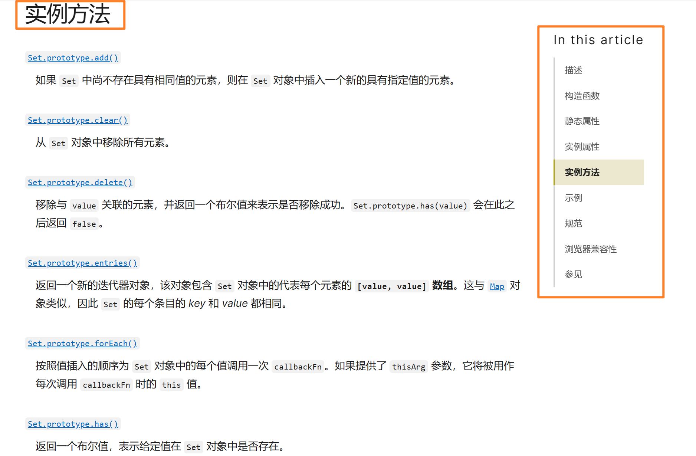
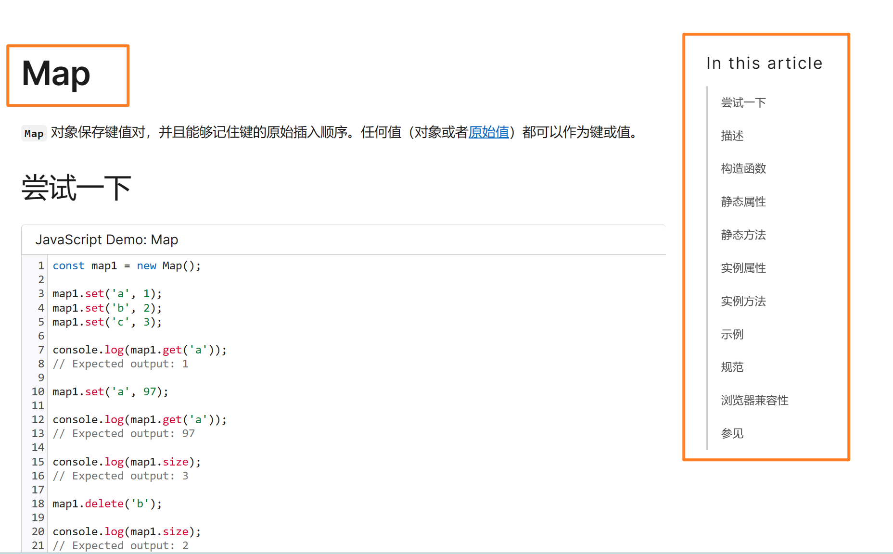

## 有效的字母异位词

### [LeetCode 题目：](https://leetcode.cn/problems/valid-anagram/)

`给定两个字符串 s 和 t ，编写一个函数来判断 t 是否是 s 的字母异位词。（判断一个字符串中的字母以及个数是否都相同，比较有意思）`

 `若 `*s*` 和 `*t*` 中每个字符出现的次数都相同，则称 `*s*` 和 `*t*` 互为字母异位词。`

**这题使用 hash 法，并且使用数组作为 hash 表**

* 这道题相当于是 t 在 s 中查找字符出现次数，在一个数据结构中查找某一个值的使用 hash 表是比较快的方式，于是选择使用 hash 表
* 为什么使用 数组 作为 哈希表呢？
  * 因为本题只可能出现小写字母，而小写字母用 ascll 码表示时是连续的 26 个字符，于是可以选择使用数组作为 hash 表
  * 数组的 下标为 key，值为 value

> 解题思路

**数组作为 Hash**

1. 创建数组，遍历 s 字符串，与 a 做差获取下标值，将对应下标位置的值 +1
2. 再遍历 t 字符串，与 a 做差获取下标值，将对应下标位置的值 -1
3. 最后遍历数组，如果有任何一个值不为0，return false，表示不是有效的字母异位词

```javascript
/**
 * @param {string} s
 * @param {string} t
 * @return {boolean}
 */
const s = 'banana'
const t = 'nabaan'
var isAnagram = function (s, t) {
  const arr = new Array(26).fill(0) // 1
  for (let i of s) {
    // 直接 i 就是 value，遍历字符串很ok
    // 很关键的是 charCodeAt() 这个函数，用来将字符串转化为 ascll 的
    arr[i.charCodeAt() - 'a'.charCodeAt()]++
  }
  for (let i of t) {
    arr[i.charCodeAt() - 'a'.charCodeAt()]--
  }
  for (let i of arr) {// 不要用 forEach，无法中断循环，并且这个 return 不会作为最终结果返回
    if (i != 0) {
      return false
    }
  }
  return true
}
console.log(isAnagram(s, t))
```

> 遇到的问题：

1. 为什么要用 hash 表，为什么要用数组作为 hash 表。这个得弄清楚！
2. 怎么样实现 字母 转为合适的 数组下标？ 这个一开始还不太会，现在知道使用 charCodeAt() 方法了。
3. 遍历取值的时候，字符串和数组都可以使用 for-of 来实现
4. 最终涉及到 return 值的时候，尽量不要用 forEach-map 这类 return 无法终止循环的方式来实现，用原生的 for 循环或 for-in\for-of即可

**看起来简单题中更加能考研 JS语法方面的问题和思维的训练，本题虽然不难但还是有很多其他方面的收获的**

---
## 两个数组的交集

### [LeetCode 题目：](https://leetcode.cn/problems/intersection-of-two-arrays/)

`题意：给定两个数组，编写一个函数来计算它们的交集。`

`输出结果中的每个元素一定是 唯一 的。我们可以 不考虑输出结果的顺序 。`

**使用 hash 表完成这题，并且使用 set 来实现**

* 为什么使用 hash 表写？
  * 因为这题本质还是在 第一个数组中寻找第二个数组中出现的元素，这种查找的就使用 hash 比较方便
* 为什么不用数组而用set？
  * 因为数组作为 hash 表比较适合有固定长度，且跨度比较小的数据中。本题虽有固定长度1000，但跨度太大，数据比较分散，就不太适合使用数组
  * 使用 set 相比 数组 虽然更耗性能（每次的寻找 key 和存放 value），但它适用于跨度大的分散的数据，还能有效去重

> 解题思路

1. 首先将第一个数组转化为 set
2. 接着创建一个 set 数据结构存放结果
3. 遍历 第二个数组，利用 set 的方法判断当前元素是否在 set 中存在，如果存在就加入到 结果set集合 中
4. 最后不要忘记将 set 转化为 数组再返回出去

```javascript
/**
 * @param {number[]} nums1
 * @param {number[]} nums2
 * @return {number[]}
 */
const nums1 = [1,2,3,4,5]
const nums2 = [10,8,6,4,2,1]
var intersection = function (nums1, nums2) {
  const nums1Set = new Set(nums1)
  const resSet = new Set()

  for(let i of nums2){// 普通 for 循环效率会比 迭代器高，如果追求效率可以使用普通 for 循环
    if(nums1Set.has(i)) resSet.add(i)
  }

  return Array.from(resSet) // 类数组转化为数组的方法

}
intersection(nums1,nums2)
```

> 遇到的问题

1. 什么时候使用 数组 作为 hash，什么时候使用 set 作为 hash ，这个地方要弄清楚

2. 使用 for 循环 实际上会比 迭代器 效率更高吗？为什么？

   1. 因为迭代器中还需要额外维护一个迭代器对象，这是会消耗一些性能的
   2. 但是好处是它不仅可以遍历数组，还能遍历任何有迭代器的对象，如字符串、对象等

3. 类数组的转化这个直接使用 Array.from() 就好，现在越来越熟练了

4. 关于 set 和 map 的使用，他们的基本使用要学会和掌握

   1. Set : add、delete、clear、size、has、[ entries]==[value,value]、[keys、values ]-->  这两个都是一样的
   2. Map: **set('key','value,)**、**get('key')**、**delete('key')**、size`tips:这是实例属性，而不是方法，注意！`、has('key')、clear()、[ entries]==[key,value]、[keys、values ]-->  这两个不一样，分别用于获取 key 和 value，类似于 对象

5. 相关链接索引 -- 学习 set 与 map，了解 **实例属性** 以及 **实例方法**

   * [Set]([Set - JavaScript | MDN (mozilla.org)](https://developer.mozilla.org/zh-CN/docs/Web/JavaScript/Reference/Global_Objects/Set))

   

   * [Map]([Map - JavaScript | MDN (mozilla.org)](https://developer.mozilla.org/zh-CN/docs/Web/JavaScript/Reference/Global_Objects/Map))

   

---
## 快乐数

### [LeetCode 题目(笔试常考类似的)：](https://leetcode.cn/problems/happy-number/)

`编写一个算法来判断一个数 n 是不是快乐数。`

`「快乐数」定义为：对于一个正整数，每一次将该数替换为它每个位置上的数字的平方和，然后重复这个过程直到这个数变为 1，也可能是 无限循环 但始终变不到 1。如果 可以变为 1，那么这个数就是快乐数。`

`如果 n 是快乐数就返回 True ；不是，则返回 False 。`

**这个题目底层还是使用哈希法，但是要善于发现**

* 操作就是将这个数字的每个字符平方再相加获得新的数字
* 不断循环以上操作，什么情况退出循环呢？
  * 当 这个数 为 1 时可以退出循环，如果 不为 1 呢？
  * 那就一直循环，直到 出现题目所说的 无限循环。这个比较关键，什么是无限循环？
  * 无限循环就是出现了曾经出现过的数字，这和之前环形链表的题十分相似，当出现相同的元素时表示有环，所以这种情况也需要 退出循环！
* 所以题目就变成了：遍历一个数组，如果出现了 1 或者 曾经出现过的值时就退出循环！
* 基于以上，使用 哈希表，并且不需要记录次数，使用 set 即可！

> 解题思路

1. 创建一个函数，单独处理 每个数平方在求和 的需求
   1. 传入一个参数：一个正整数
   2. 将这个正整数每个数平方再求和
   3. 返回这个正整数
2. 创建一个 set ，用于存放每一个出现过的数字
3. 循环操作这个正整数，当 这个正整数 为 1 或 重复出现时退出循环
4. 循环体内部将这个正整数执行以上函数重新赋值
5. 最后比较这个 最终的值 与 1 是否相等，作为返回值（布尔类型）

```javascript
/**
 * @param {number} n
 * @return {boolean}
 */
let n = 19
const getNum = n => {
  let sum = 0
  while (n > 0) {
    // 当 n = 0 时退出循环
    sum += (n % 10) ** 2
    n = Math.floor(n / 10) //注意 js 中除法包含小数，不会自动向下取整的
  }
  return sum
}
var isHappy = function (n) {
  const set = new Set()
  while (n !== 1 && !set.has(n)) {
    set.add(n)
    n = getNum(n)
  }
  return n === 1
}
console.log(isHappy(n))
```

> 遇到的问题

1. 遇到这种有两个操作的题目，可以在外部将额外的操作用函数处理一下，内部只需要调用函数即可！以后刷题也尽量使用这种方式实现，提升刷题效率
2. 后面遇到死循环的问题了，快速复制到 vscode 中进行验证，使用 debug 和 断点 很快就找到问题了，能省很多时间，笔试的时候也使用这种方法节约时间！
3. 在最后的循环中只重新赋值了 n 的值，但是忘记了将 n 的值存入 set 中，导致出错了
4. 在最后的 while 循环中使用了：(n === 1 || !set.has(n)) ，这是错误的，要思考清楚循环的条件，不要想着退出循环条件，不然容易搞反
   1. 如果想着：当n不等于 1 并且 n 不属于 set 中时就进行循环，这样得出的答案就是：(n !== 1 && !set.has(n))
5. 最后 题目有map 的方法，但是我还是不太熟悉 map ，看看上面记录的 set 与 map！现在记录了一遍后又熟悉一些了！


---
## 两数之和

### [LeetCode 题目：](https://leetcode.cn/problems/two-sum/)

`给定一个整数数组 nums 和一个目标值 target，请你在该数组中找出和为目标值的那 两个 整数，并返回他们的数组下标。`

`你可以假设每种输入只会对应一个答案。但是，数组中同一个元素不能使用两遍。`

**使用 hash 法来实现这个题目，用 map 作为 hash 表**

* 这道题为什么使用 hash 法呢？
  * 这得涉及到思考这道题的解题方法是怎么样的了
  * 一开始我是想着遍历第一个元素，然后遍历后续数组元素寻找 9-i 的值，但这想起来似乎又变成了 暴力，两个 for 循环的方式了
* 这主要是固定思维导致的原因，实际上可以使用一次遍历就完成这个题目
  * 遍历过的元素用一个 hash 表存放起来
  * 每次遍历一个元素后，就在已经遍历过的元素中查找是否有 目标值
    * 如果有目标值就获取它的下标，并且作为结果返回出去
    * 如果没有目标值就将当前的值存到 hash 表中，继续往后遍历
    * 这样又实现了 不重复使用 **同一个元素** 的需求，实在是太妙了！
* 这个固定思维的转化完全没问题！只是 根据 **起始元素** 去找 **终止元素** ，还是根据 **终止元素** 去找 **起始元素** 的区别而已！希望这个思维能慢慢体会到学习到
* 为什么要用 map 作为 hash 表呢？
  * 因为这次需要存放的不仅是 目标值，还得包括 它的下标，有两个值，所以使用 map 比较合适
  * 在 Javascript 中，使用 map 和使用 对象 都是可以的，map 和 对象的区别也就是 key 的类型不同而已，但 map 有一些方法可以使用就用 map 好了（虽然 对象 也有 map 对应方法 的自己 的实现，但规定一下，刷算法的时候就用 map 好了）

> 解题思路
1. 创建一个 hash 表，使用 map 作为 hash 表
2. 遍历 数组 元素，并且将这个值的目标值 在 map 中搜索
   1. 如果有就构造结果返回
   2. 如果没有就将这个值存入 map 中 ，接着遍历数组
3. 因为 力扣 原题说每个输入都有对应的一个答案，所以不可能存在找不到的情况，不需要额外 return 别的值

```javascript
/**
 * @param {number[]} nums
 * @param {number} target
 * @return {number[]}
 */
const arr = [2,7,11,15]
const target = 9
var twoSum = function(nums, target) {
	const map = new Map()
    for(let i = 0;i<nums.length;i++){
        if(map.has(target - nums[i])){
            return [map.get(target - nums[i]),i]
        }else{
            map.set(nums[i],i)
        }
    }
};
twoSum(arr,target)
```

> 总结

1. 因为在写答案之前，思路捋得非常清晰了，所有的注意点都考虑到思考到了。同时与题目无关的 JS 方面的核心素养，也在前面的题目中修炼的比较完善了，关于 map 的使用、hash 表的使用等等都非常熟练。最终带来的效果就是写这道题目很顺畅，按着脑子的想法写出来就完成了！
2. 这种感觉很舒服，在写题目之前思考清楚所有的思路了。
3. 现在还存在两个问题：
   1. 下次看题解之前，先自己思考一下如果是自己会怎么写，这样虽然刷题速率下降了，但是有助于帮助自己积累题目思路！这很好，趁还没几题简单题了，锻炼一下思维
   2. 还有就是对于面试的情况，会有 **ACM 模式**的情况，**node 环境**的目前虽然还没背下来，但可以直接复制使用。**浏览器模式**还根本不会，上次360的题目就被这个卡死了
   3. 今晚 数字马力 的或许是 牛客 发的题目，有牛客的环境就使用 node 的就好，注意 字符串与数字 之间的转化就好。笔试完花时间整理一下 **Node 环境** 以及 **浏览器环境** 的 ACM 写法

---
## 四数相加II
> （主要就是练习hash的感觉了，算法思想不太多）
---
## 赎金信
> （和字母异位词类似，不同的在于第二个字符串包含了第一个字符串需要的元素就可以了）
---
## 三数之和
> （主要就是练习hash的感觉了，算法思想不太多，但是很多笔试题也是比较考察这些细节的处理，以及不怕麻烦敢去处理，正确的处理）
---
## 四数之和
> （与 四数相加 不太一样，和三数之和类似，只是更多了一层复杂的处理）
---
## 总结
---
